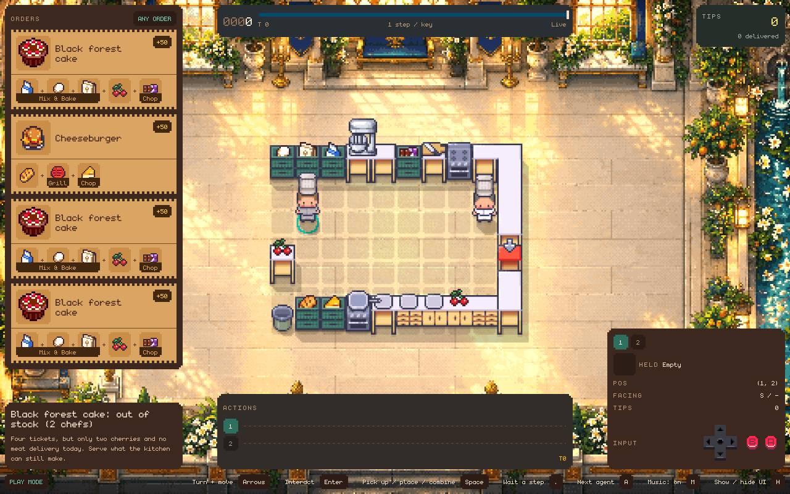

# Too Many Chefs! The Open Kitchen Challenge

Too Many Chefs is a cooking game inspired by Overcooked. Chefs move through a
grid-based kitchen, collect and prepare ingredients, and deliver finished
dishes. Play using the keyboard or write a *controller*: a program that
selects the chefs' actions.



## Before You Start

You need:

- A terminal. On macOS, use the Terminal app. On Windows, use PowerShell or
  WSL. On Linux, any terminal works.
- A local copy of the project. Run all commands below from the project
  directory.
- [uv](https://docs.astral.sh/uv/getting-started/installation/), the tool
  that installs and runs the project. Follow the installation instructions,
  then close and reopen your terminal. uv downloads a suitable Python version
  automatically; a separate Python installation is not required.

## Set Up

In the project folder, run:

```bash
uv sync --extra fast-downward --extra native
```

This installs the project with two optional packages:

- `fast-downward` is a *planner* used by the built-in controller to determine
  the chefs' actions.
- `native` provides a separate window for the kitchen visualiser.

If installation fails because `up-fast-downward` is unavailable for your
platform, use pyperplan instead. This affects some ARM platforms; Apple
Silicon Macs are supported. pyperplan supports all platforms but is slower:

```bash
uv sync --extra pyperplan --extra native
```

Verify the installation:

```bash
uv run cook --help
```

You should see a list of commands, such as `play`, `agent` and `replay`. You
run each one as `uv run cook <command>`.

Use the same `--extra` options when running `uv sync` again. Omitting them
removes the planner.

## Try It Out

### Play a kitchen yourself

```bash
uv run cook play --level levels/demos/coconut_juice.yaml
```

A window opens with a small kitchen and one chef. The order shown at the top
left requires coconut juice: chop a coconut, place the juice on a plate and
deliver it.

| Key | What it does |
| --- | --- |
| Arrow keys | Turn and walk |
| `Enter` | Use what's in front of the chef: take an ingredient, chop or cook, or hand in a dish |
| `Space` | Pick something up, put it down, or put one thing onto another, such as juice onto a plate |
| `.` | Wait one step |
| `M` | Turn the music on or off |
| `H` | Hide or show the panels |

The keys are also listed along the bottom of the window. Close the window to
stop.

### Watch a controller play

```bash
uv run cook agent --level levels/0_i_can_cook/0_0_coconut_juice_finished_on_counter.yaml
```

Press `Space` in the window to start. The juice is already prepared, so the
chef needs only to plate and deliver it. This is the only kitchen supported
by the starter controller.

When the run ends, a card shows the score. Select `Quit` to close the window.
The terminal also prints the result.

### Replay a recording

```bash
uv run cook replay --recording-path examples/recording.yaml
```

A replay starts paused. Press `Space` to play or pause, and the `Left` and
`Right` arrow keys to step back and forward.

## If No Window Opens

If a separate window cannot be opened, the terminal displays a link such as
`http://127.0.0.1:8080/`. This can occur on some Linux systems or during an SSH
session. Open the link in a web browser to view the kitchen.

To use a browser every time, add `--no-window` to the command. To stop a run
from the terminal, press `Ctrl+C`.

## Next Steps

- [Installation](docs/installation.md): optional packages, planner support
  by platform, and test instructions.
- [Play, Replay and Agent Modes](docs/modes.md): every panel and key in the
  visualiser.
- [Agent Runs](docs/agent-runs.md): choosing a controller, running without a
  window, teams, time limits, and result fields.
- [PDDL Solvers](docs/solvers.md): available planners and solver selection.
- [Command-Line Reference](docs/command-line.md): every command and option.
- [Writing Levels](docs/levels.md): the level file format and included
  kitchens.

## Licence

MIT. See [LICENSE](LICENSE).
