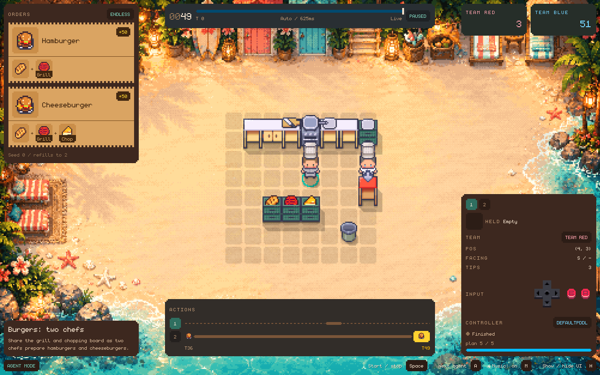
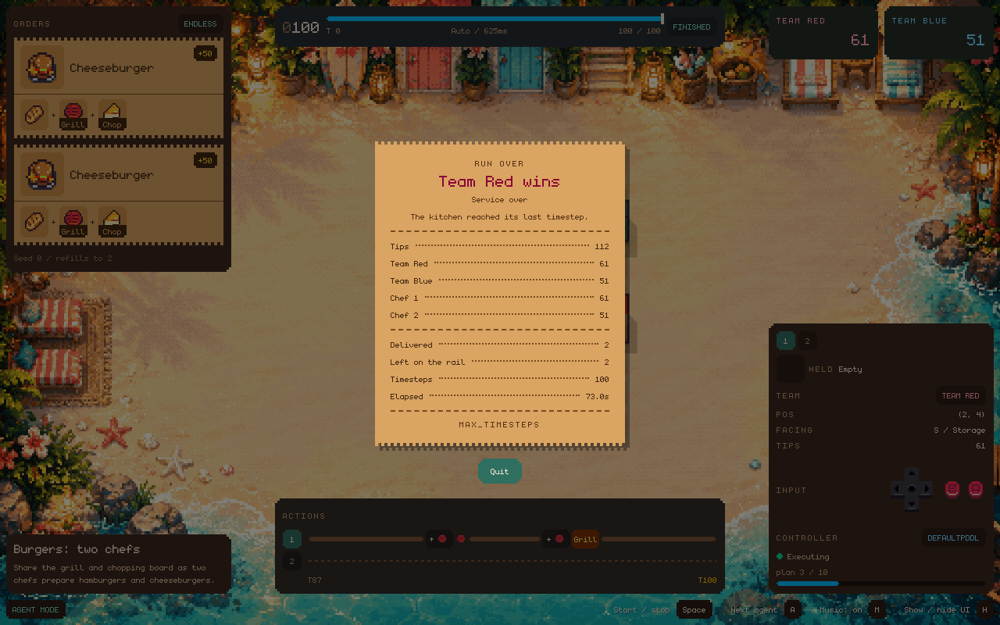

# Agent Runs

`cook agent` runs a controller on a level and reports the result. This page
covers choosing a controller, running without the visualiser, teams, planning
budgets, end conditions, and result fields. The visual interface is described in [Play, Replay and Agent Modes](modes.md#agent-mode).

## Choosing a Controller

By default `cook agent` runs the built-in PDDL controller; use `--controller`
to select any controller from the controller registry:

```bash
uv run cook agent --level levels/demos/burger.yaml --controller open
```

Controllers are registered by name in `controllers/__init__.py` via
`controllers/registry.py`. The built-in names are:

- `pddl`: the PDDL planning controller (default)
- `open`: the open controller for Part 4's competition, in
  `controllers/open/submission/`

`--assign` assigns specific chefs to other controllers. Unspecified chefs
use `--controller`. See [Teams](#teams) for an example.

## Running Without the Visualiser

```bash
uv run cook agent --level levels/demos/burger.yaml --headless
```

Headless agent mode is different from visual agent mode:

- it auto-starts immediately
- it runs as fast as possible
- it does not wait for keyboard input

A headless run with infinite orders requires an end condition.
See [End Conditions and Results](#end-conditions-and-results).

## Recording a Run

To record an agent run:

```bash
uv run cook agent --level levels/demos/burger.yaml --record --recording-out-file recordings/agent.yaml
```

[Replay mode](modes.md#replay-mode) plays the recording back.

## Controller Plugins

`cook controllers` lists the names accepted by `--controller`. Each controller
is registered as a plugin in `controllers/__init__.py`. The plugin defines
construction, options, availability checks, result metadata and any commands
registered under its name. The command-line interface has no controller-specific
logic.

A plugin is a `ControllerPlugin` from `controllers/registry.py`. A minimal
plugin specifies the controller name and a factory function:

```python
from controllers import ControllerOptions, ControllerPlugin, register_controller


def create(options: ControllerOptions) -> Controller:
    return MyController()


register_controller(
    ControllerPlugin(name="mine", summary="Does my thing.", create=create)
)
```

Options are a `ControllerOptions` subclass with one field per flag. A field
becomes `--<name>-<field>`, or the flag named in its `json_schema_extra`, and
its description is the help text. The PDDL plugin in
`controllers/pddl/plugin.py` demonstrates the other fields: a `check` that reports
installation requirements, a `describe` that records the selected planner, and
a `commands` group exposed as `cook pddl solvers`.

## Teams



A kitchen can be split into teams. Repeat `--team` to assign agents:

```bash
uv run cook agent --level levels/demos/burger_2p.yaml --team red=1 --team blue=2
```

Chefs are named by badge number, which is the number on each chef's tab in the
`Agents` panel and at the head of their lane in the `Actions` panel. A level that gives its
chefs names in `legend.agents` can use those instead. Play mode takes `--team`
too, so two people at one keyboard can cook against each other.

Teams and controllers are independent. A controller can control one or more
teams, and a team can be split across controllers. Scores still belong to the
agent that earned them. To run a controller per side:

```bash
uv run cook agent --level levels/2_overcooked/0_1_black_forest_cake_parallel_stations_4p.yaml \
  --team red=A,B --team blue=C,D \
  --assign pddl=A,B --assign open=C,D
```

This example uses named chefs because `--assign` accepts only names.
`--team` also accepts badge numbers, allowing teams in levels without named
chefs. Assigning those chefs to separate controllers requires names in the
level definition.

A level can define its own teams:

```yaml
teams:
  red: [1, 2]
  blue: [3, 4]
```

If any team is named on the command line, the command-line rosters replace the
level rosters. An agent omitted from every roster is unassigned. Its score
counts for the kitchen but not for a team.

Recognised team colours are red, blue, green, yellow, purple and orange.
Plural names such as `reds` use the corresponding colour. Other team names
are displayed in gray.

While a run is active, the top right shows a board for each team in place of
the kitchen's total. The agent panel shows the selected agent's team.
The ending card lists the teams and identifies the winner or a draw.

## Planning Budget

`--planning-budget` limits each controller to a total number of seconds of
planning time for the run. Once the budget is exhausted, the controller cannot
submit further actions:

```bash
uv run cook agent --level levels/demos/burger.yaml --headless --planning-budget 30
```

The budget belongs to the controller, not to an agent. A controller driving four
agents shares one 30-second budget across them. With `--assign`, each named
controller gets a separate budget.

The budget includes time spent in `get_actions` and time spent by a background
worker after that call returns. The PDDL controller searches in a subprocess,
so both intervals count. Workers start before the run
begins, so startup time is excluded from both the budget and `--time-limit`.

If a controller exceeds its budget, its current action is kept and later calls
return no actions. The agent inspector shows `Out of time`, and the budget bar
updates during a search.

## End Conditions and Results

Without an explicit condition, an agent run ends when its controller reports
that it is finished. Infinite-order levels do not reach that state. These
options add other end conditions and can be combined:

- `--time-limit SECONDS` ends the run after the specified wall-clock duration.
- `--max-timesteps N` ends it at timestep N. The visualiser shows the timeline
  as a fraction of N.
- `--end-on-orders-delivered` ends it once every order has been delivered. An
  expired order does not count as delivered.
- `--end-on-budget-exhausted` ends it once every controller has spent its
  planning budget. This is enabled by default because the simulation
  cannot advance once all controllers have exhausted their budgets. If you turn it off with
  `--no-end-on-budget-exhausted`, give the run a `--time-limit` to stop it
  instead.

Headless runs of infinite-order levels require `--time-limit`,
`--max-timesteps`, or a planning budget that can be exhausted.



Headless runs check end conditions before requesting controller actions and
stop immediately when a condition is met. Visual runs stop the simulation and
display the
[ending card](modes.md#agent-mode).

Either way, agent mode prints a JSON simulation result and can also write it to a
file with `--result-out-file`:

```json
{
  "run": {
    "level": "levels/demos/burger_2p.yaml",
    "controllers": [
      {
        "controller": "pddl",
        "agents": [],
        "details": { "solver": "fast-downward", "solver_selection": "automatic" }
      }
    ],
    "teams": {
      "red": ["4e39"],
      "blue": ["7f6a"]
    },
    "headless": true,
    "planning_budget_seconds": null,
    "end_conditions": {
      "time_limit_seconds": 30.0,
      "max_timesteps": null,
      "end_on_orders_delivered": false,
      "end_on_budget_exhausted": true
    }
  },
  "reason": "completed",
  "score": 52,
  "score_by_agent": {
    "4e39": 4,
    "7f6a": 48
  },
  "score_by_team": {
    "red": 4,
    "blue": 48
  },
  "timesteps": 13,
  "orders_delivered": 1,
  "orders_remaining": 0,
  "elapsed_seconds": 2.6,
  "error": null
}
```

`run` records the run configuration, allowing the result to be interpreted
without the original command. `level` is the path as it was given.
`controllers` lists each controller and the chefs it owns; an entry with an
empty `agents` list is the `--controller` default, which controls chefs not specified by
`--assign`. `details` contains controller-specific metadata. For the PDDL controller, `solver` names the planner that ran and
`solver_selection` records how it was selected: `named` if `--solver` chose
it, `automatic` if the first installed solver in priority order was selected.
The open controller records nothing. `teams`, `headless`,
`planning_budget_seconds`, and `end_conditions` repeat the options the run
started with. `run` is `null` for a run driven from code rather than from the
command line.

`reason` is `completed` when the controller has no more actions and no orders
remain. It is `gave_up` when the controller has no more actions but orders
remain. Use this value to distinguish a completed service from a planner that
found no plan. `stopped` means that a visual session was closed early. Other
values identify the ending condition: `time_limit`, `max_timesteps`,
`orders_delivered`, or `planning_budget_exhausted`. If conditions match on the
same step, the first matching option wins.

`error` means an exception ended the run. A controller may have raised one, or
the planner may have rejected the PDDL it was given. The result then carries an
`error` object with the exception's `type`, `message` and `traceback`; for an
exception from a planning worker, the traceback includes the worker's own. Its
`stage` identifies when the exception occurred: `import` when the controller's code would
not import, `build` when the controller raised while it was being built, and
`run` once the run had started. The PDDL controller imports the students'
modules only when a run uses it, so a module with a syntax error ends that run
with `stage` set to `import` and leaves other controllers and commands working.
Results accumulated before the error are retained in `score` and `timesteps`. Without `--quiet` the traceback is printed as well. The
command exits with status 0 whenever it prints a result, so a script that reads
the JSON handles a failed run the same way as any other.

`score` is the kitchen total. `score_by_agent` splits it by agent id in badge
order and includes agents with no score.

`score_by_team` groups the score by team. It is empty when no teams are
configured. Team totals equal the kitchen total only when every agent belongs
to a team. An unassigned agent contributes to the kitchen total only.
