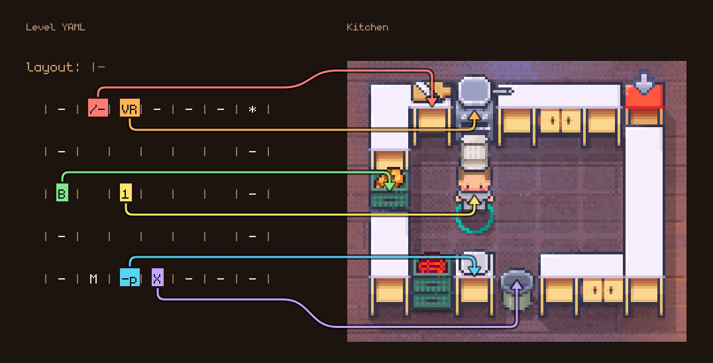

# Writing Levels

Level files are YAML documents with these main sections:

- `name`: optional display name; the UI falls back to the filename
- `description`: optional short description shown beneath the name
- `layout`: the map grid
- `state`: current orders and other initial runtime state
- `legend`: what each layout symbol means
- `recipes`: cook and combine recipes
- `bounds`: optional explicit bounds override
- `rules`: optional order visibility, ordering, time limits, timed cooking,
  and actions per step
- `scoring`: optional rewards for order progress and delivery
- `soundtrack`: optional music played during the level

Names and descriptions may be omitted or set to `null`. Blank names also use
the filename; blank descriptions are hidden. Metadata is retained in recordings
so replays show the same level details.

```yaml
name: Burger kitchen
description: Grill patties, slice cheese, and assemble two kinds of burger.
```

## Minimal Structure

```yaml
layout: |-
  | - | - | - | * |
  | - | 1 | B | - |
  | - | - | - | - |

state:
  orders:
    - catalog/food/hamburger
appearance:
  background: 5
legend:
  counters:
    - symbol: "-"
  storages:
    - symbol: B
      food_name: catalog/food/bun
  deliveries:
    - symbol: "*"
  agents:
    - symbol: "1"
      orientation: s
  foods:
    - name: catalog/food/bun

recipes:
  cook: []
  combine: []
```

## Layout



The `layout` is a grid. This project commonly uses cell-delimited rows like this:

```yaml
layout: |-
  | - | 1 |   | * |
  | - | B | M | X |
```

Each cell can contain:

- a single symbol like `1`, `B`, or `*`
- multiple symbols in the same cell like `-p` or `/-`
- spaces for an empty cell

Examples from the existing levels:

- `-` means a counter
- `1` or `2` means an agent
- `B`, `M`, `C` can be ingredient storages
- `*` is a delivery tile
- `X` is a bin
- `D` is a plate dispenser
- `S` is a sink
- `/-` means a cutboard on top of a counter
- `-VR` means a stove with a pan on it, set on a counter. A stove is only
  burners, so it needs a counter or an oven under it.
- `OVR` means an oven with a stove and pan on top. Put the oven first, so the
  burners are drawn on its top.
- `-p` means a plate on a counter

When multiple symbols appear in one cell, the loader places them together and automatically attaches portable items to counters or equipment when appropriate.

## Legend

The `legend` defines what symbols in the layout mean. Supported sections are:

- `agents`
- `bins`
- `counters`
- `deliveries`
- `equipment`
- `plates`
- `plate_dispensers`
- `sinks`
- `foods`
- `storages`

Examples:

```yaml
appearance:
  background: 5
legend:
  counters:
    - symbol: "-"
  equipment:
    - symbol: /
      name: catalog/equipment/cutboard
    - symbol: V
      name: catalog/equipment/stove
    - symbol: R
      name: catalog/equipment/pan
  storages:
    - symbol: B
      food_name: catalog/food/bun
  deliveries:
    - symbol: "*"
  agents:
    - symbol: "1"
      orientation: s
```

Notes:

- Layout symbols must be a single character.
- Symbols must be unique across the full legend.
- Agents support `orientation: n | s | e | w`.
- Some entries accept `held_item` to specify food held at the start of the level.
- Equipment can define flags like `requires`, `can_pick_up`, and `can_process_food`, and the `cook_time` and `cooks_by_itself` settings described under [Timed Cooking](#timed-cooking).
- Equipment can define `sound`, the clip played while processing food. If omitted, a generic clip is used.

## Plates and Washing Up

Dishes require plates for delivery. Provide plates with `plates`,
`plate_dispensers`, or both.

```yaml
legend:
  plates:
    - symbol: p
  plate_dispensers:
    - symbol: D
      plate_count: 3
```

A dispenser holds a finite stack. Delivery returns the plate to the first
dispenser in the level, preserving the supply even with infinite orders.
With `infinite_supply: true`, a dispenser always provides a plate and does
not track returned plates.

Set `returns_dirty: true` to return used plates after delivery:

```yaml
legend:
  plate_dispensers:
    - symbol: D
      plate_count: 3
      returns_dirty: true
  sinks:
    - symbol: S
```

Used plates cannot hold food. An agent must carry a used plate to a sink and
wash it. A dispenser returns clean plates before used plates. If a level dirties
plates without providing a sink, it can serve only `plate_count` dishes.

Two settings support starting a level mid-service: `dirty_plate_count` starts a
dispenser with used plates already in it,
and `dirty: true` on a `plates` entry leaves a used one on a counter.

The interact key washes when a chef is facing a sink. In a plan, that is a
`Wash` mutation at the sink's location. See
`levels/demos/burger_washing_up.yaml`.

## Station Sounds

`sound` accepts a filename, a list of alternative clips, or a mapping that also specifies volume and pitch variation. Paths are relative to `assets/audio`.

```yaml
equipment:
  - symbol: /
    name: catalog/equipment/cutboard
    sound: chop.ogg
  - symbol: V
    name: catalog/equipment/stove
    sound: [metalPot2.ogg, metalPot3.ogg]
  - symbol: O
    name: catalog/equipment/oven
    sound:
      clips: [doorClose_1.ogg, doorClose_4.ogg]
      gain: 0.4
      jitter: 0.04
```

Provide several clips per station where possible. The browser avoids repeating the
same clip twice in a row. `jitter` detunes each play by up to the specified
fraction.

Setting `sound` on equipment in a level overrides its definition in `catalog/equipment.yaml`.

## Soundtrack

`soundtrack` names the level music. Tracks are mp3 files in
`assets/audio/soundtrack` and are referenced by file stem.

```yaml
soundtrack:
  - we-can-cook-together-side-a
  - we-can-cook-together-side-b
```

One name is shorthand for a one-track playlist. The long form also sets the
music volume:

```yaml
soundtrack: low-key-cooking-side-a
```

```yaml
soundtrack:
  tracks: [turning-up-the-heat, galaxy-famous-chef]
  gain: 0.25
```

The visualiser plays tracks in order and loops the playlist. Music starts on the
first keypress because browsers block autoplay. Pressing `M` turns the music off
without pausing playback, so turning it back on resumes at the same place.

`gain` defaults below the cue levels. A level without `soundtrack` uses cues
only.

The included levels select playlists by difficulty. `low-key-cooking` covers the
single-chef kitchens in `0_i_can_cook`, `we-can-cook-together` covers the
co-op kitchens in `1_we_can_cook`, and `digital-kitchen` covers both. The
remaining playlists are used by `2_overcooked`, the eight-chef kitchen, and
other difficult levels. `tests/test_soundtrack.py` checks that every playlist
name has a corresponding file.

## Foods and Recipes

`legend.foods` must include every food item used anywhere in the level, not just the raw ingredients. That includes:

- order outputs
- storage outputs
- recipe ingredients
- intermediate recipe results
- held items placed on agents, counters, equipment, or plates

Example:

```yaml
legend:
  foods:
    - name: catalog/food/cheese
    - name: catalog/food/sliced_cheese
    - name: catalog/food/bun
    - name: catalog/food/meat
    - name: catalog/food/grilled_meat
    - name: catalog/food/hamburger

recipes:
  cook:
    - ingredient: catalog/food/meat
      with: catalog/equipment/pan
      to_make: catalog/food/grilled_meat
  combine:
    - ingredients: [catalog/food/bun, catalog/food/grilled_meat]
      to_make: catalog/food/hamburger
```

If a referenced food is missing from `legend.foods`, loading the level will fail validation.

## Illegal Recipes

By default, cooking and combining require a defined recipe. Unsupported
combinations, such as bread in a pan or two buns together, have no effect.
A level can permit these actions:

```yaml
rules:
  allow_illegal_recipes: true
```

With this rule enabled, any station that cooks something accepts any ingredient, and
any two items can be combined on a counter, in a station, or on a plate.
Undefined recipe results become either `catalog/food/dubious_food` or
`catalog/food/rock_hard_food`. Neither can be delivered or scored. Discard them
in a bin.

The ingredients and timestep determine which result is produced, ensuring
that replay reproduces the recorded outcome.

Two cases remain invalid. A station with no cook recipe in the level refuses
ingredients, and a plate is not a cooking station. Pressing the cook key on a
plated dish has no effect.

The two garbage items are provided by the rule, so
`legend.foods` does not have to declare them. Declaring one anyway overrides its
art. See `levels/demos/burger_anything_goes.yaml`.

## Timed Cooking

By default, stations cook with a single interaction. A level can enable
individual station cooking times:

```yaml
rules:
  timed_cooking: true
```

Under this rule, each station follows two settings from its equipment
definition. `cook_time` specifies the cooking duration. `cooks_by_itself`
determines whether cooking progresses automatically or requires a chef to
interact once per step, as with chopping in Overcooked. The catalog defines
these defaults:

| Station | `cook_time` | `cooks_by_itself` |
| --- | --- | --- |
| Cutboard | 3 | no |
| Mixing bowl | 3 | yes |
| Pan | 4 | yes |
| Deep fryer | 5 | yes |
| Pot | 6 | yes |
| Oven | 8 | yes |

If neither setting is specified, the station cooks with one interaction.
Levels can override these settings in the legend, as with other catalog fields:

```yaml
legend:
  equipment:
    - symbol: O
      name: catalog/equipment/oven
      cook_time: 12 # a slow oven
    - symbol: R
      name: catalog/equipment/pan
      cooks_by_itself: false # a pan the chef has to work
```

Stations that share a name must agree on `cooks_by_itself`, because a planner
treats them as one kind of equipment. Their cook times may differ.

Automatic stations start cooking when food with a valid recipe is placed
inside. The food is ready `cook_time` steps later, and the chef who placed it
receives the preparation reward. Interacting with the station has no effect.
For manual stations, the chef who completes the final interaction receives
the reward. Both types display a cooking progress bar.

Some details:

- Cooking progress is stored with the food in the station and is retained
  while the chef is away. Removing the food or adding an ingredient resets it.
- Equipment cooks only while placed on its required station. Removing a pan
  from a stove preserves its progress; cooking resumes when it is replaced.
- If the result of a station that cooks by itself has its own recipe there, it
  keeps cooking. A level can use this for burning, with a recipe that turns
  `grilled_meat` in a pan into burnt meat. With illegal recipes on, any food left
  in such a station after it finishes turns into garbage.
- Time keeps passing while food cooks by itself. In agent mode the simulator
  steps even when the controller returns no actions, unless the controller is
  still planning. In play mode, press `.` to wait a step.

See `levels/demos/burger_timed.yaml`, where the pan grills by itself and the
cheese takes three chops.

## Orders

Orders are defined under `state.orders`:

```yaml
state:
  orders:
    - catalog/food/hamburger
    - catalog/food/cheeseburger
```

Optional rules control delivery order, visibility, and timing:

```yaml
rules:
  strict_ordering: false
  order_reveal: sequential # all | sequential
  default_order_time_limit: 20 # timesteps after each order is revealed
```

Levels can also enable infinite mode, where orders never run out. The listed
`state.orders` become a pool of order templates: whenever an order is
delivered or expires, a replacement is drawn from the pool deterministically
based on `order_seed`:

```yaml
rules:
  infinite_orders: true
  order_seed: 0 # change for a different deterministic order sequence
  max_visible_orders: 2 # defaults to the number of listed orders
```

Infinite mode ignores `order_reveal` and requires at least one entry in
`state.orders`. An infinite level never finishes on its own, so headless agent
runs must set `--time-limit`. See `levels/demos/burger_infinite.yaml` for an
example.

By default, each step permits one turn and one movement or other action per
chef, equivalent to one keypress in play mode. If a controller submits more,
the simulator retains each chef's first turn and first action, executes the
turns first, and discards the excess. This limit is applied before legality
checks, so a discarded action cannot replace an illegal one.
`actions_per_step` sets the number of movements or other actions permitted
per chef. Set it to `null` to remove the limit:

```yaml
rules:
  actions_per_step: 2 # defaults to 1; null runs every mutation as sent
```

Optional scoring rewards completed orders and useful recipe progress:

```yaml
scoring:
  default_order_reward: 50
  retrieve_order_component_reward: 1
  produce_order_component_reward: 1
  produce_ordered_item_reward: 1
```

`default_order_reward` applies to orders without an explicit `reward`.

An order component is an ingredient or intermediate recipe output that
contributes to a currently visible order.

Progress rewards for a food are limited to the quantity required by visible
orders. Retrieving a second tomato for one salad earns no reward, while two
salad orders allow rewards for two tomatoes. The count is shared across
orders. When an order is served or expires, its allocation is released,
allowing a tomato retrieved for the next order to earn a reward. Each team
maintains a separate count, so its progress does not reduce the rewards
available to other teams.

## Catalog Defaults

If your project has a nearby `catalog/food.yaml` or `catalog/equipment.yaml`, level definitions can inherit defaults from those files. The loader searches upward from the level file to find a `catalog/` directory.

## Example Levels

The [demo collection](../levels/demos/README.md) covers recipes, team sizes,
divided kitchens, prepared ingredients, finite supplies, order rules, and
washing up. Start with `levels/demos/coconut_juice.yaml` or
`levels/demos/burger.yaml`; see the collection index for each level's purpose.

The graded practice sets have separate directories, each with a README:
`levels/0_i_can_cook` for solo kitchens, `levels/1_we_can_cook` for multiple
chefs, and `levels/2_overcooked` for more difficult kitchens. `levels/3_too_many_chefs`
contains the symmetric 2v2 kitchen used in Part 4's competition.
