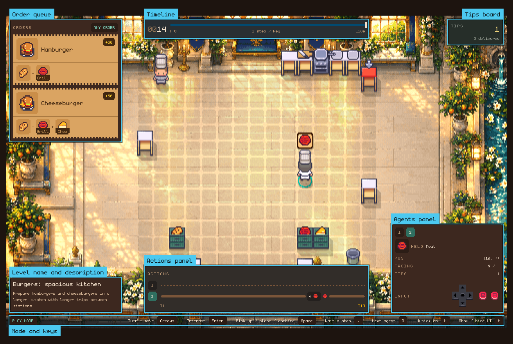
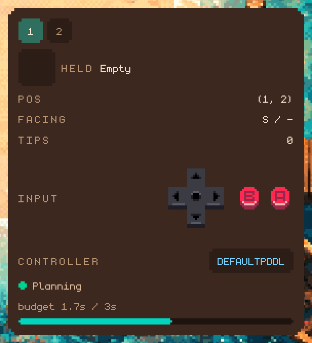

# Play, Replay and Agent Modes

`cook play`, `cook replay` and `cook agent` show the kitchen in the
visualiser. This page covers how the visualiser opens, what each panel shows,
and the keys in each mode. The [Command-Line Reference](command-line.md) lists
every option.

## The Window

Modes that show a kitchen open a window and print its URL or status in the
terminal. Closing the window ends the run.

On WSL, the simulator finds Edge or Chrome on the Windows side and opens the
visualiser in app mode. The `native` extra is not used there.

On other systems, pywebview provides the native window. Install it with the
`native` extra described under [Installation](installation.md#extras). On
Linux, pywebview also needs a display and GTK or Qt Python bindings, which the
extra does not install.

Pass `--no-window` to any visual mode, or run on a machine without a desktop,
to use a browser instead:

```
╭─ 👀 OPEN THIS LINK IN YOUR BROWSER ─────────────────────────────╮
│                                                                 │
│  The kitchen is running, but no window was opened.              │
│                                                                 │
│  Open this link in your browser to watch it:                    │
│                                                                 │
│      http://127.0.0.1:8080/                                     │
│                                                                 │
│  Why there is no window: pywebview is not installed             │
│                                                                 │
│  ● Waiting for you to open the link ...                         │
│                                                                 │
╰─────────────────────────────────────────────────────────────────╯
```

The status indicator shows whether the browser is connected. Runs use port 8080
when it is available, then scan higher ports.

`--no-window` serves the visualiser for browser access. The `agent`
command's `--headless` option runs without serving or rendering the visualiser.

`--quiet` disables terminal status output. On an `agent` run, only the result
JSON is written to stdout:

```bash
uv run cook agent --level levels/demos/burger.yaml --quiet > result.json
```

Use `--quiet` with a window, or use `--no-window` only when the port is known.

## Play Mode

Example:

```bash
uv run cook play --level levels/demos/burger_large.yaml
```

Play mode opens the visualiser and gives you direct control over an agent.



UI overview:

- Top left is the order queue: outstanding orders and their ingredients. When delivery order is enforced, the next required ticket is marked `Next`.
- Top centre is the timeline: the current timestep and simulation speed.
- Top right is the tips board, with the number of orders delivered. A kitchen split into teams shows a board for each side instead, with that side's running total.
- Bottom left is the level's name and description.
- Bottom centre is the `Actions` panel, with a lane for each chef and a column for each of the last 14 steps. Bars represent movement and begin with the carried item. Dotted lines indicate waiting. Boxes represent actions: an item and arrow for picking up or placing, a verb for station work, and a gold box for delivery. Hover over a segment for its description.
- Bottom right is the `Agents` panel: a tab per chef, then the selected chef's held item, position, facing target, and a control pad highlighting the inputs from the last step. The selected chef's lane in `Actions` has the same highlighted tab.
- The bottom edge names the mode on the left and lists the available keys on the right.

Controls:

- `Arrow keys`: turn and move the selected agent
- `Enter`: interact with the tile in front of the agent
- `Space`: pick up, place, or combine
- `.`: wait a step without acting, for example while a station cooks
- `A`: switch to the next agent
- `M`: turn music on or off
- `H`: show or hide the interface

The `M` line in `Controls` reads `Music: on` or `Music: off`. It affects the
soundtrack only; action cues continue to play. Playback position is retained while
the music is muted.

If a level has multiple agents, pressing `A` cycles through them. In play mode, this changes both the controlled chef and the displayed panel.

To record a play session:

```bash
uv run cook play --level levels/demos/burger.yaml --record --recording-out-file recordings/burger.yaml
```

## Replay Mode

Example:

```bash
uv run cook replay --recording-path recording.yaml
```

Replay mode loads a previously recorded run and starts paused. It waits for keyboard input before playback begins.

UI overview:

- Top left shows the level.
- Top centre is the timeline. The bar shows the current position relative to the recording's total length.
- Bottom centre is the `Actions` panel. Its lanes show actions through the current frame.
- Bottom right is the `Agents` panel, showing the selected chef as of the frame on screen, including the buttons that chef pressed to produce it.
- The bottom edge shows `Replay mode` and the replay hotkeys.

Controls:

- `Space`: play or pause
- `Right`: step forward one timestep
- `Left`: step back one timestep
- `A`: switch to the next agent
- `M`: turn music on or off
- `H`: show or hide the interface

The agent panel shows one chef at a time. Press `A` to inspect another chef at the current frame.

Replay uses recorded mutation data when available, so newer recordings preserve the same transition animations shown during live play.

## Agent Mode

Example:

```bash
uv run cook agent --level levels/demos/burger.yaml
```

Agent mode runs a controller in the visualiser. By default this is the
built-in PDDL controller. [Agent Runs](agent-runs.md) covers choosing another
controller, running without the visualiser, recording, teams, and end
conditions.



UI overview:

- The level's name and description are at the bottom left.
- Top centre is the timeline and loop status. Top right shows tips, or team totals when teams compete.
- Bottom centre is the `Actions` panel: what each chef did on each of the last 14 steps. It displays completed actions, excluding future controller plans.
- Bottom right is the `Agents` panel. It shows the selected chef's state, team, individual tips and controller. It also displays the controller's status (planning, executing or idle), current inputs and remaining planning budget, if configured.
- The bottom edge shows `Agent mode` and the start and stop hotkey.

Visual agent mode starts stopped and waits for input from the page before the simulation begins.

Controls:

- `Space`: start or stop the agent loop
- `A`: switch to the next agent
- `M`: turn music on or off
- `H`: show or hide the interface

When a run ends, the visualiser displays a receipt-style summary card over
the kitchen, showing the end reason, score, deliveries, timesteps and elapsed
time. It also shows per-agent and per-team scores when applicable, and a run
between teams displays the winner first. The card uses the same values as the JSON
result.
Select `Quit` to exit. The card remains visible when the HUD is hidden, and
`Space` does not restart a finished run.

For multiple chefs under a composite controller, press `A` to select the chef to inspect.

While running, the agent advances at the rate defined by
`VISUAL_STEP_INTERVAL_MS`. Stopping pauses the current frame.
