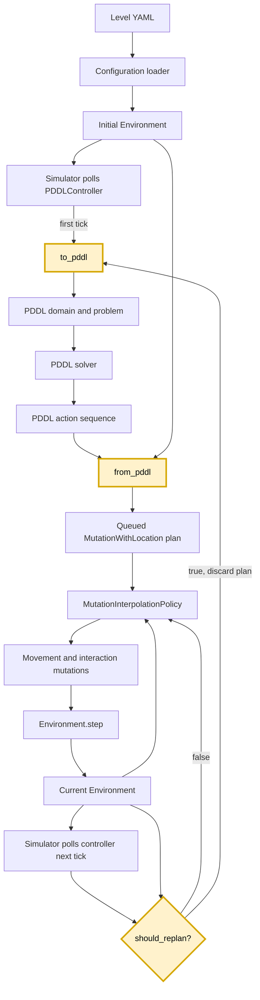

# Getting Started Guide

This guide introduces the simulator and the codebase you will work in for the
Too Many Chefs controller assignment. It explains how the simulator represents the
kitchen, how controllers plug into it, and which files you will edit.

Read this guide alongside two other documents:

- The [Assignment Specification](../too-many-chefs-docs/assignment-specs.md) describes the assignment
  itself: the parts, recipes, evaluation, scoring, and submission requirements.
- [`README.md`](README.md) is the simulator's own manual: installation, the
  play/agent/replay modes, command-line options, and the level file format.

## Installing and Running

Follow the [README](README.md) to install the project and a PDDL solver, then
run a level. `uv sync` alone does not install a PDDL solver. The three modes
used in this assignment are:

```bash
# Drive an agent yourself with the keyboard
uv run python main.py play --level levels/demos/coconut_juice.yaml

# Run a controller in the visualiser
uv run python main.py agent --level levels/demos/coconut_juice.yaml

# Replay a recorded run step by step
uv run python main.py replay --recording-path recording.yaml
```

Play mode is the fastest way to learn the game rules: walk an agent through a
recipe by hand before trying to model it in PDDL. See the README's
[Play Mode](README.md#play-mode), [Agent Mode](README.md#agent-mode),
[Replay Mode](README.md#replay-mode), and
[Command Line Options](README.md#command-line-options) sections for the
controls and full option lists, including headless runs, time limits,
recording, and JSON result output.

The first two open the kitchen in a native window. To use a browser, or to work
over SSH without a display, add `--no-window` and open the printed link. The README's
[The Window](README.md#the-window) section covers what gets opened where.

## Understanding the Simulator

The main simulator type is the `Environment` class in
`simulator/environment.py`. An environment is a snapshot of the entire kitchen
at one timestep. Its `entities` dictionary contains everything in the
simulation, including agents, food, equipment, counters, storages, delivery
locations, map bounds, and global game state.

Entities are the simulator's data model. For example, an `Agent` records its
position, orientation, and held item; a piece of `Food` records its name and
location; and an `Equipment` entity may contain food. Most simulator updates
return a new environment with updated entities instead of modifying the
existing environment in place.

One special entity is `OvercookedState`. Unlike a physical kitchen object, it
does not occupy a grid location. It stores information that applies to the
whole problem, including:

- the orders that must be delivered;
- definitions for all foods available in the level;
- cook recipes, which describe an ingredient, a piece of equipment, and the
  resulting food;
- combine recipes, which describe two inputs and their resulting food.

The simulation advances through `Environment.step(mutations)`. A step receives
a sequence of mutations and runs them one at a time, in order. Each mutation
takes the current environment and returns the next environment. This ordering
matters: a later mutation in the same step observes the result of every earlier
mutation. Illegal mutations are logged and skipped. After the sequence, the
environment applies its tick mutations (described below) and the timestep
advances.

### Mutations and Agent Actions

A mutation is an action that changes the environment in a predetermined way.
The base `Mutation` interface defines `run(environment)`,
`describe(environment)`, and `virtual_input(environment)`. The concrete
mutations available to controllers are:

| Mutation           | Effect                                                                                                     |
| ------------------ | ---------------------------------------------------------------------------------------------------------- |
| `MoveAgent`        | Moves an agent by a supplied `(dx, dy)` offset when the destination is walkable.                           |
| `MoveAgentForward` | Moves an agent one cell in its current orientation.                                                        |
| `TurnAgent`        | Changes the direction an agent is facing.                                                                  |
| `TakeFromStorage`  | Creates the storage's food item and places it in an agent's free hands.                                    |
| `PickUp`           | Picks up food or portable equipment from the location the agent is facing.                                 |
| `Place`            | Places held food or portable equipment on a valid counter or support.                                      |
| `Combine`          | Combines the held item with food or equipment at the facing location according to a combine recipe.        |
| `Cook`             | Works food in the facing equipment towards its cook recipe. Illegal at stations that cook by themselves.   |
| `Deliver`          | Delivers an ordered dish held on a plate at a delivery location.                                           |
| `Discard`          | Removes held food, or food contained in held equipment.                                                    |
| `Wash`             | Cleans the used plate in an agent's hands at the sink it is facing, one plate at a time.                   |
| `Interact`         | Convenience action that selects `TakeFromStorage`, `Cook`, `Deliver`, `Discard`, or `Wash` from the facing object. |
| `PickUpOrPlace`    | Convenience action that selects `PickUp`, `Place`, or `Combine` from the current context.                  |

`virtual_input` answers which button on a six-input pad a mutation reads as:
one of `up`, `down`, `left`, `right`, `a` for reaching into a station, or `b`
for handling what is in your hands. The visualiser draws a pad per agent and
lights whatever the step pressed, so you can watch your controller play the
game on the same six inputs a person has. A mutation with no button behind it
returns `None`.

More specifically, these are all **agent mutations**: they extend
`AgentMutation` and identify the acting agent with `agent_id`. Agent mutations
may also include optional `expected_*` fields. These fields act as safety
checks, allowing a planned action to fail instead of manipulating the wrong
food or equipment when the real environment no longer matches the plan.

Some changes to the kitchen happen on every step without any agent acting.
These are tick mutations: they extend `TickMutation`, live in
`Environment.tick_mutations`, and are built by the loader from the level's
`rules`. `Environment.step` applies them after the agents' mutations.
Controllers never return them, and they are not recorded with a step's actions.

The only tick mutation so far is `AdvanceCooking`. Levels with
`rules.timed_cooking` give each piece of `Equipment` a `cook_time` and a
`cooks_by_itself` flag. `AdvanceCooking` cooks food in stations with the flag,
finishing it `cook_time` steps after it goes in, and `Cook` is illegal there.
Every other station needs `cook_time` presses of `Cook`, and the food cooks on
the last one. Without the rule, every station has a `cook_time` of 1 and cooks
with a single `Cook`. `simulator/mutations/cooking.py` provides
`cooking_progress` and `cook_presses_left` to see how far along a station is,
and `simulator/mutations/advance_cooking.py` provides `cooking_output` to see
what a station that cooks by itself will make.

For this assignment, symbolic PDDL actions normally translate to the explicit
mutations such as `TakeFromStorage`, `PickUp`, `Place`, `Combine`, `Cook`, and
`Deliver`. Movement does not need to be fully represented in every symbolic
plan. A translated action is paired with its target grid location in a
`MutationWithLocation`, and the controller's mutation interpolation policy
pathfinds to that location, turns the agent, and executes the mutation.

## Level Files

Practice levels are YAML files in `levels/`. A level file defines both the
initial environment and the rules that are available in that problem. Its main
sections are:

| Section           | Purpose                                                                                                                                               |
| ----------------- | ----------------------------------------------------------------------------------------------------------------------------------------------------- |
| `layout`          | A grid of symbols describing where entities are initially placed. Cells may contain more than one symbol, such as a counter with a plate or cutboard. |
| `bounds`          | Optional explicit map dimensions. If omitted, they are inferred from the layout.                                                                      |
| `state.orders`    | The food names that count as successful deliveries.                                                                                                   |
| `legend`          | Maps layout symbols to entity definitions: agents, counters, equipment, storages, plates, plate dispensers, sinks, bins, food, and delivery locations. |
| `recipes.cook`    | Defines transformations of the form ingredient + equipment -> output.                                                                                 |
| `recipes.combine` | Defines transformations of the form two ingredients -> output.                                                                                        |

For example, a storage legend entry connects a symbol to the food it supplies,
while an equipment entry connects a symbol to an equipment name. The loader
reads each layout cell, looks up its symbols in the legend, and creates the
corresponding entities at that coordinate. The orders and recipes are stored in
the level's `OvercookedState` entity.

Food and equipment definitions can inherit defaults from `catalog/food.yaml`
and `catalog/equipment.yaml`. However, the level must still make every food used
by its storages, starting items, recipes, and orders available through
`legend.foods`. This includes intermediate foods such as chopped ingredients
and cooked recipe outputs. Use the level data instead of hard-coding a map or
recipe.

To write practice levels for debugging, see
[Writing Custom Levels](README.md#writing-custom-levels) in the README, which
documents the full format including order rules, infinite-order mode, and
scoring options.

## Simulator and Controller Architecture

At every simulator tick, the simulator asks the controller for the mutations
that should happen next. Controllers are registered by name in a controller
registry (`controllers/registry.py`, with registrations in
`controllers/__init__.py`) and selected with the `--controller` command-line
option. Each registration is a plugin that also declares the controller's
command-line options, so `--solver` comes from the PDDL controller's plugin
rather than from the command line itself. Parts 1 to 3 assess the
`PDDLController`, which is the default. Part 4's competition runs the
`OpenController` in `controllers/open/submission/` instead; see
[Part 4: the 2v2 competition](#part-4-the-2v2-competition).

On the first tick, the controller uses the initial environment to call your
problem generator's `to_pddl`, invokes the PDDL solver, and passes the
resulting symbolic action sequence to `from_pddl`. This produces a complete
queued plan of `MutationWithLocation` values.

The solver is interchangeable. Every planner sits behind the
`Solver` interface in `controllers/pddl/solvers/base.py` and registers itself
by name, and a run either takes the first installed one in a fixed order or is
told which to use with `--solver`. `to_pddl` produces the same domain and problem for every
solver, and `from_pddl` receives the same `PDDLPlanStep` type. Solvers can
differ in runtime and plan choice. See
[Solvers](README.md#solvers) in the README for what is available and how to
install it.

Replanning is controlled by your problem generator. On every tick
where a plan exists and no planning is already in flight, the controller calls
your problem generator's `should_replan(environment)` with the current
environment. Returning `True` discards the queued plan and runs the full
`to_pddl -> solver -> from_pddl` pipeline again from the current state;
returning `False` keeps executing the existing plan. `should_replan` runs in
the main simulator process once per tick, so it must be fast and must not
block.

One exception: if one of the controller's chefs is carrying a pot, pan or bowl
when `should_replan` returns `True`, the controller keeps the current plan until
the chef has set it down, then replans. A new plan never starts while a
station is out of place.

The base class does not replan, so a minimal controller can aim to
produce one valid plan from the initial state.
An invalid or unreachable planned action does not automatically trigger
another PDDL solve; detecting that situation and recovering from it is exactly
what `should_replan` is for.

Between replans, the simulator continues to poll the controller once per tick.
The controller reads from the already-computed plan and returns the next
simulator mutations. The framework executes the plan. Your responsibility is to
describe the required actions in the correct order.

Plans may contain either:

- high-level interaction mutations, such as taking an ingredient, combining
  items, cooking, or delivering, paired with the location where the interaction
  must occur; or
- explicit `TurnAgent` and `MoveAgentForward` mutations, which are executed
  faithfully in the order supplied.

You should normally use high-level interaction mutations. A
`MutationInterpolationPolicy` sits between the queued plan and the simulator.
On every tick, it reads both the next planned action and the current
environment. If the action's target is elsewhere in the kitchen, the policy
pathfinds toward it and emits the required movement and turning mutations. Once
the agent is next to the target, facing it, and the interaction is legal, the
policy emits the planned mutation and consumes that action from the queue.

For example, a plan can specify `Cook` at a cutboard on the other side of the
map without listing movement steps. The interpolation policy navigates to the
cutboard before attempting the mutation.



The highlighted nodes are the components you implement directly.

The important boundary is between planning and execution. PDDL and the
translated mutation queue describe what should happen, in what order, and at
which interaction locations. The controller, interpolation policy, and
simulator handle the tick-by-tick movement and execution of that plan.

## The Files You Will Edit

Your work lives in one folder, `controllers/pddl/submission/`:

- `overcooked.pddl`: the PDDL domain describing the actions, predicates,
  types, and effects needed to model the kitchen.
- `problem_generator.py`: `DefaultProblemGenerator`, which builds a PDDL
  problem from a simulator environment and decides, on every tick, whether the
  controller should replan.
- `from_pddl.py`: `DefaultFromPDDL`, which converts a symbolic plan into
  executable simulator mutations for one or more agents.

In the starter code these files run a small working example from `demo.py` in
the same folder, in which every chef turns to face the other way. Replace the
example with your own model; `demo.py` can go once nothing imports it.

`DefaultProblemGenerator` and `DefaultFromPDDL` implement the abstract base
classes `ProblemGenerator` and `FromPDDL` in `controllers/pddl/interfaces.py`,
which also defines `PDDLProblem` and `PDDLPlanStep`. That file is the contract
the controller expects, so leave it as it is. `DefaultPDDLController` in
`controllers/pddl/default_controller.py` already connects your two classes to
the planner and needs no changes either.

Helper code can live in those files or in modules of your own in the same
folder, which your files import. The contest server grades the `submission/`
folder on a fresh copy of the starter code, so a change anywhere else,
including to the interfaces or the simulator, is not used.

`to_pddl` and `from_pddl` run in separate, isolated Python processes, so you
must communicate only through their defined inputs and return values.
`should_replan` runs in the main simulator process; state you record inside
`to_pddl` is not visible to it.

An exception raised in any of these methods ends the run with `reason` set to
`error`. The result keeps the score reached so far and holds the traceback in
its `error` field, including the part raised inside a worker process. PDDL the
planner cannot parse ends the run the same way, with the planner's complaint in
the message. So does a module of yours that will not import, for example
because of a syntax error; the result's `error.stage` is then `import` rather
than `run`.

### `problem_generator`

`DefaultProblemGenerator` is your subclass of `ProblemGenerator`. Its
`to_pddl(environment, controlled_agent_ids)` method receives the current
`Environment`, and the chefs your controller moves (`None` means all of them;
other chefs stay in the kitchen as obstacles). It must return a valid
`PDDLProblem`, containing:

- a valid PDDL domain string;
- a valid PDDL problem string;
- objects for relevant agents, foods, equipment, and grid locations;
- initial facts that accurately describe the current environment;
- recipe and capability facts needed by the domain actions;
- goal facts representing the level's outstanding orders.

The generated pair of PDDL files must agree with one another: every predicate,
type, and action used by the problem must be defined by the domain. The
translation must be derived from the supplied environment so that it works for
unseen layouts, agent ids, recipes, and object locations.

`DefaultProblemGenerator` may also override `should_replan(environment)`. The controller
calls it once per tick with the current environment; returning `True` discards
the queued plan and generates a fresh problem from the current state, once no
chef of yours is carrying a station. Use it to react to new orders, expired
orders, or a plan that has stopped making progress. Keep it cheap: it runs on
every tick in the main simulator process.

### `from_pddl`

`DefaultFromPDDL` is your subclass of `FromPDDL`. It is built around the
environment the plan was made for, and its `from_pddl(steps)` method receives
the PDDL solver's action sequence as a list of `PDDLPlanStep` values. It must convert
each symbolic action into an appropriate simulator mutation and target
location, returned as a list of `MutationWithLocation` values.

The translation must:

- resolve symbolic agent and object names back to entities in the environment;
- map each supported PDDL action to the matching agent mutation;
- attach the grid location at which the interaction must occur;
- preserve action order;
- populate useful `expected_*` fields so stale or incorrect plans fail safely;
- reject unsupported or malformed actions clearly.

Under `rules.timed_cooking`, two things change for `from_pddl`. A station cooked
by hand may need several `Cook` mutations for one symbolic cook action, one per
press it still needs; food already part-way through needs fewer. And a plan may
take food out of a station that cooks by itself before the station has
finished. The interpolation policy holds an action for as long as it is
illegal, so the chef waits by the station, but only if the mutation names the
food it expects. For a portable station such as a pan, set
`expected_held_equipment_contents_name`. Without it, `PickUp` lifts the pan with
whatever is in it, and cooking stops once the pan leaves the stove.

`PickUp` on a pan, pot or mixing bowl lifts the station together with the food
in it. A `Combine` that pours that food onto a plate or into another station
leaves the chef holding the empty station, and the chef's hands stay full until
a `Place` sets it down, normally back on the stove or mixer it came from. If
your domain treats taking food out of a station as picking up the food alone,
`from_pddl` must add that `Place` itself.

You do not generally need to emit every turn and forward movement from
`from_pddl`. The interpolation layer uses each target location to generate
legal movement, orient the agent toward the target, and then attempt the
interaction mutation.

## Part 4: the 2v2 competition

Part 4 is a separate controller with its own folder,
`controllers/open/submission/`. `controller.py` there holds `OpenController`,
and the contest server grades that folder and nothing else, so helper modules
go beside it. It is not a PDDL controller: any technique works, PDDL included,
as long as it uses only what the starter code installs. The server runs it with
no network.

In a match every chef has a controller of its own, each in its own process.
Yours drives one chef; a classmate's drives your teammate, and two more drive
the other team. `self.controllable_agents(environment)` returns your chef. The
rest of the kitchen, including every other chef and what it holds, is in the
`Environment` for all to see. Controllers cannot talk to each other.

- **Ticks.** Every timestep the match sends each controller the kitchen and
  gives it 200 ms to return its chef's actions from `get_actions`. An answer
  that comes later is dropped and the chef stands still that timestep. Time
  passes either way: a game is 300 timesteps.
- **Sets.** The four play two games in one kitchen, and the teams swap sides
  of the kitchen between them. The team with the higher total score over the
  two games wins the set; equal totals draw.
- **Kitchens.** A set is played in a kitchen drawn from
  `levels/3_too_many_chefs/`. Every kitchen there is symmetric, with two teams
  of two chefs, and orders keep coming for the whole game. The contest uses
  the same kitchens.
- **Crashes.** If your controller raises, will not import, or its process
  dies, the set ends there. So does an action for any chef other than yours.
- **Each game starts fresh.** A new `OpenController` is built for every game,
  so anything it remembers lasts one game.

`controllers/open/example.py` is a sparring partner that only walks around.
Play a set on your own machine with `cook match`, giving four seats: `example`,
a checkout of the starter code such as `.`, or a submission folder. The first
two seats are one team and the last two the other:

```bash
uv run python main.py match --seat . --seat . --seat example --seat example --replay-dir replays
uv run python main.py replay --recording-path replays/game-1.yaml.gz
```

What each controller prints shows up marked with its seat, and a crash shows
its traceback. `--level` picks the kitchen, and `--tick-ms`, `--games` and
`--max-timesteps` let you try other limits; the competition uses the
defaults. Your controller also runs on its own with
`uv run python main.py agent --controller open`, which is quicker for trying
out a single chef.

## Development Workflow

A practical loop for developing your controller:

1. **Play the level by hand** in play mode to understand the recipe and the
   kitchen rules.
2. **Inspect the generated PDDL.** Before debugging plans, check that the
   domain and problem your generator produces are valid and describe the state
   you expect.
3. **Run headless for fast feedback.** `--headless` with `--time-limit` runs as
   fast as possible and prints a JSON simulation result; `--result-out-file`
   writes it to disk for scripted checks.
4. **Use the visualiser to debug failures.** Watching a run shows where a plan
   stalls or an agent takes an illegal action; recording a run and stepping
   through it in replay mode helps pin down the exact timestep.
5. **Write small custom levels** that isolate one mechanic, such as one cook
   step, one combine, or a divided kitchen, following
   [Writing Custom Levels](README.md#writing-custom-levels) in the README.

Practice levels to work through are listed in
[Example Levels](README.md#example-levels); start with
`levels/demos/coconut_juice.yaml` and progress toward the longer recipes in the
order the [Assignment Specification](../too-many-chefs-docs/assignment-specs.md) introduces them.
